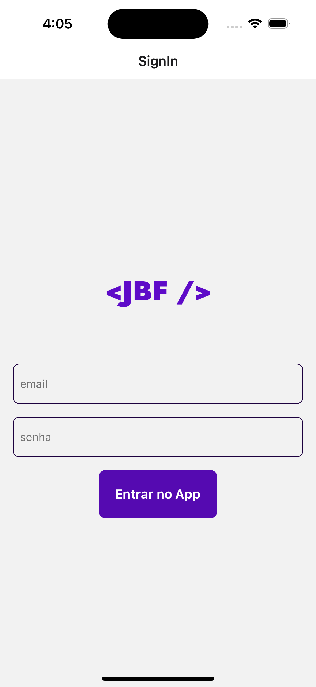
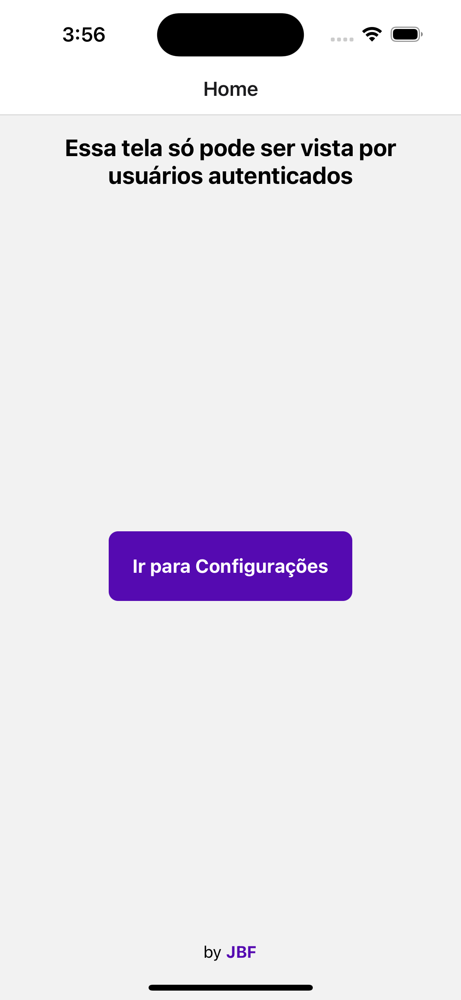
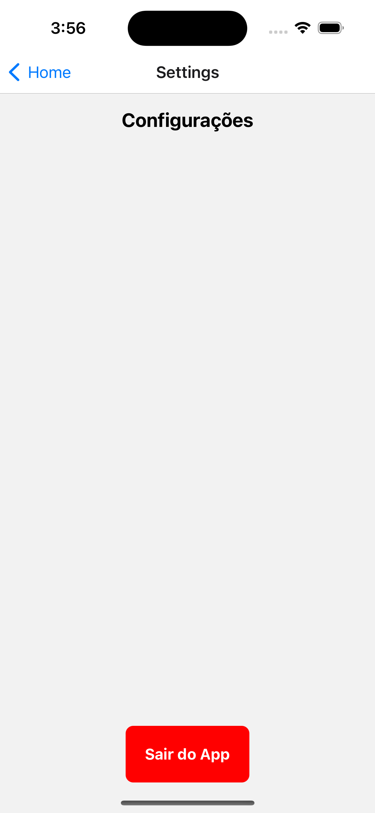

# Exemplo de Login com React Context 🟢 🚀 💻 

## 🚀 Criar Aplicativo
npx create-expo-app --template

## 💻 Dependencias
- React Navigation
yarn add @react-navigation/native
npx expo install react-native-screens react-native-safe-area-context
yarn add @react-navigation/native-stack

- Async Storage
yarn add @react-native-async-storage/async-storage

## Screens do App

