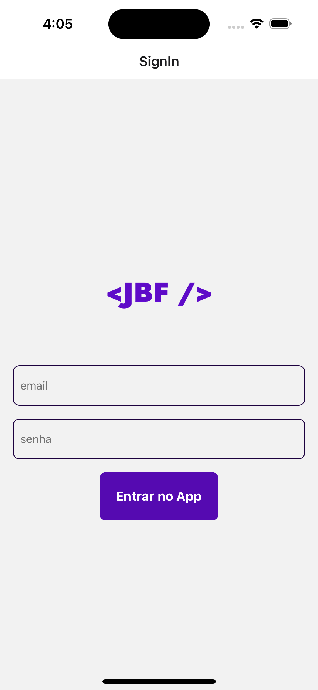
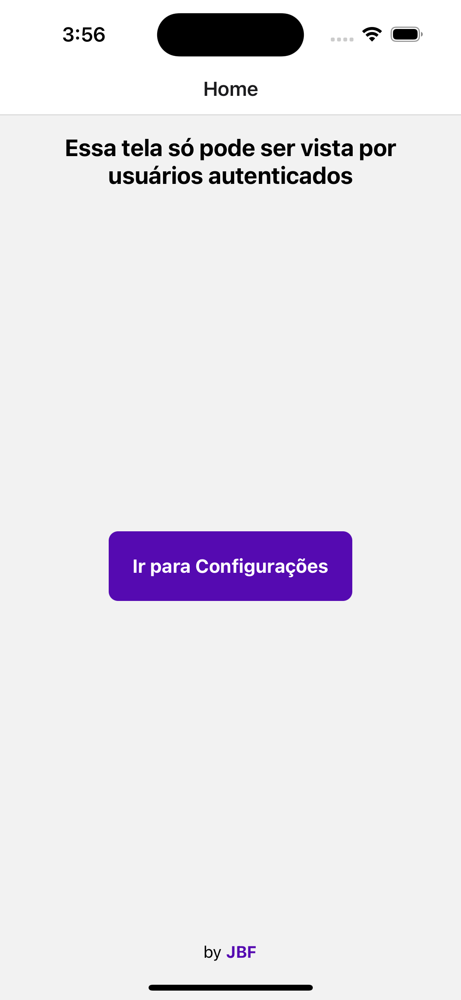
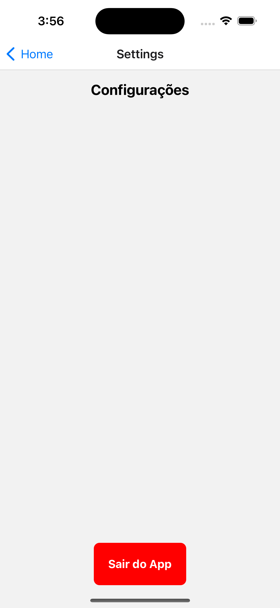

# 🟢 Exemplo de Login com React Context


<h1 align="center">
  <!--  -->
  <br />
  <a href="https://www.linkedin.com/in/jonasbfranco">
    
  </a>
  <a href="https://github.com/jonasbfranco/exemplo-ReactContext/network">
    
  </a>
  <a href="https://github.com/jonasbfranco/podcastr-nlw05/stargazers">
    
  </a>
</h1>
<p align="center">
  <a href="#page_facing_up-descrição">Descrição</a>&nbsp;&nbsp;&nbsp;|&nbsp;&nbsp;&nbsp;
  <a href="#clipboard-Funcionalidades">Funcionalidades</a>&nbsp;&nbsp;&nbsp;|&nbsp;&nbsp;&nbsp;
  <a href="#-tecnologias">Tecnologias</a>&nbsp;&nbsp;&nbsp;|&nbsp;&nbsp;&nbsp;
  <a href="#closed_book-instalação">Instalação</a>&nbsp;&nbsp;&nbsp;|&nbsp;&nbsp;&nbsp;
  <a href="#man-Autor">Autor</a>&nbsp;&nbsp;&nbsp;|&nbsp;&nbsp;&nbsp;
  <a href="#memo-Licença">Licença</a>
</p>
<p align="center">
<br><br>
    &nbsp;&nbsp;
    &nbsp;&nbsp;
    &nbsp;&nbsp;
<br><br>
</p>


## :page_facing_up: Descrição

Este app foi desenvolvido para utilizar o React Conetxt e analisar suas funcionalidades nas rotas que precisam de proteçao Sign In (usuário logado).


## :clipboard: Funcionalidades

- [x] Fazer autenticação com email e senha.
- [x] Todos os dados são salvos no Local Storage do dispositivo.


## 🛠 Tecnologias

Este projeto foi desenvolvido com as seguintes tecnologias

- [React Native](https://reactnative.dev/)
- [Expo](https://expo.io/)
- [TypeScript](https://www.typescriptlang.org/)


## :closed_book: Instalação

### :rocket: Pré-requisitos

Antes de começar, você vai precisar ter instalado em sua máquina as seguintes ferramentas:
[Git](https://git-scm.com), [Node.js](https://nodejs.org/en/) ou [Yarn](https://classic.yarnpkg.com/en/), [Expo](https://expo.io/), Um dispositivo físico ou um emuldador, Baixe o Expo Client no seu dispositivo para [IOS](https://apps.apple.com/br/app/expo-go/id982107779) ou [Android](https://play.google.com/store/apps/details?id=host.exp.exponent), Além disto é bom ter um editor para trabalhar com o código como [VSCode](https://code.visualstudio.com/)

```bash
# Clone este repositório.
$ git clone https://github.com/jonasbfranco/exemplo-ReactContext.git

# Vá para a pasta Plantmanager_NLW-5
$ cd exemplo-ReactContext

# Instale as dependências
$ npm install ou yarn install

# Execute aplicação
$ npm run start
ou
$ yarn install

# Leia o Código QR com Expo Client que você baixou no seu dispositivo

```


## 💻 Dependencias usadas no projeto
#### React Navigation
- yarn add @react-navigation/native
- npx expo install react-native-screens
- react-native-safe-area-context
- yarn add @react-navigation/native-stack

#### Async Storage
- yarn add @react-native-async-storage/async-storage


## 📱 Screens do App


## :man: Autor

<a href="https://github.com/jonasbfranco/">
 
 <br />
 <sub><b>Jonas B. Franco</b></sub>
</a>

Feito com ❤️ por Jonas B. Franco :wave::wave: Entre em contato! 🚀

<a href="https://www.linkedin.com/in/jonasbfranco">
  
</a>

## :memo: Licença

Copyright © 2023 [Jonas B. Franco](https://github.com/jonasbfranco).<br />
This project is [MIT](./.github/LICENSE.txt) licensed.